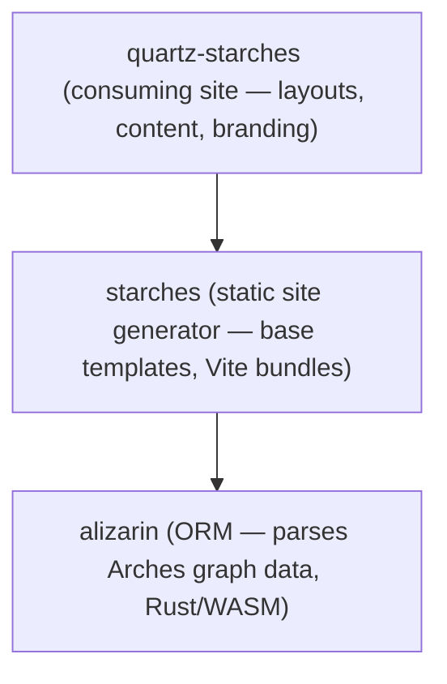

# Quartz Starches

A reference implementation for [Starches](https://github.com/flaxandteal/starches) — publishing [Arches](https://www.archesproject.org/) cultural heritage data as a searchable, map-enabled static website. It demonstrates how to consume Starches as a Hugo module and customise it for a specific heritage dataset and brand.

## Features

- **Full-text search** powered by [Pagefind](https://pagefind.app/) with faceted filtering
- **Interactive maps** using [MapLibre GL](https://maplibre.org/) with spatial filtering via FlatGeobuf tiles
- **Asset detail pages** with tabbed content (Overview, Location, Related Resources), image galleries, and PDF export
- **Responsive design** following the QLD Design System
- **WCAG 2A/2AA accessible** — validated by Cypress + axe-core E2E tests
- **Static output** — deployable to any static hosting (Azure Static Web Apps, Nginx, etc.)

## Architecture

Quartz Starches sits at the top of the Starches module stack:



Hugo's template lookup order lets this project override any layout or partial from Starches while inheriting the rest. TypeScript entry points in `assets/` are bundled by Vite through Hugo Pipes.

### Theme/Components

The frontend hugo theme and components are situated within a separate repo - [hugo-theme-qld-design-system](https://github.com/flaxandteal/hugo-theme-qld-design-system). This contains all the components and layouts for the site. 

These can be overwritten by duplicating the file and its structure into `layouts/`

### Data flow

```
Arches JSON exports (prebuild/business_data/)
  → starches-builder ETL (preindex, Pagefind index, FlatGeobuf tiles)
  → Hugo + Vite build
  → Static site (docs/)
```

### Config files

Due to the nature of the project, the hugo params and page content are not stored in the repo but on the Azure blob storage. This allows you to set your own content for local development.

You need to add files to 
```
content/
│   ├── _index.md
│   ├── asset.md
│   ├── map.md
config/
    └── _default/
        └── params.yaml
``` 

The easiest solution is to pull the site specific files using
```
npm run fetch:content
```
This will then have the correct structure in the markdown

## Prerequisites

- **Node.js** 20+
- **Hugo Extended** (v0.145+)
- **Go** 1.21+ (for Hugo modules)
- Pre-built data in `prebuild/` (heritage asset exports, graphs, reference data). This can be found in the blob storage
- Set up a .env with `BLOB_BASE_URL`

## Getting Started

```bash
git checkout dev
```

```bash
npm install
```

### Local development

> **Optional — parallel repo setup**
>
> Dev has currently been setup to run with several repos running in parallel. There is a hugo work file set up to read any changes made to starches and the hugo theme if you have them cloned locally
>
> To set up these repos locally, skip this step if you do not need to edit the theme or starches:
>
> ```bash
> cd .. # so you are one level above the project
>
> git clone git@github.com:flaxandteal/hugo-theme-qld-design-system.git
> git clone https://github.com/flaxandteal/starches
>
> cd quartz-starches
> ```

//TO DO - Need to add in adding the hugo modules (merge the theme into the original)
Switch the npm run dev (this only works with parallel matching) to npm start
Create a test prebuild
Fix the tests

1. **Fetch the data** - You can fetch the data from the blob storage using

    ```bash
    npm run fetch:prebuild
    ```

    You will need to have the environment variables set up in your project for the Azure blob storage


2. **Process the data** — you need to first process and index the data for starches and pagefind to use

    ```bash
    npx --node-options=--inspect --node-options=--max-old-space-size=8192 \
      starches-builder etl \
      --file ./prebuild/business_data/t_output_df_all.json \
      --prefix qld- --summary
    ```

    Change the file name after business data to change the processed data

3. **Index the data**

    ```bash
    npx starches-builder index --site docs
    ```

4. **Run the project locally**

    ```bash
    npm run dev
    ```

    This starts the site at [http://localhost:1313](http://localhost:1313) with live reload.

### Building

Full production build (fetch content, build Hugo with minification):

```bash
npm run build:full
```

The static site is output to `docs/`.


## Project Structure

```
quartz-starches/
├── assets/              # TypeScript entry points (bundled by Vite)
│   ├── asset.ts         #   Asset detail page
│   ├── map.ts           #   Interactive map
│   ├── search.ts        #   Pagefind search
│   └── ...
├── content/             # Hugo content pages
├── config/
│   └── _default/
│       └── params.yaml  # Site parameters (fetched from blob storage)
├── cypress/             # E2E tests
│   └── e2e/
│       ├── asset.spec.js
│       └── layout.spec.js
├── layouts/             # Hugo templates (overrides starches base)
│   ├── index.html       #   Home page
│   ├── _default/        #   Asset + map page layouts
│   └── partials/        #   Header, footer, navbar, components
├── prebuild/            # Arches data exports + ETL config
├── static/              # CSS, JS, images, Handlebars templates
│   ├── css/
│   ├── js/
│   └── templates/       #   Runtime Handlebars templates
├── utils/               # Build-time scripts (reindex, fetch, precompile)
├── hugo.yaml            # Hugo configuration + module imports
├── Dockerfile           # Multi-stage build (Node/Hugo → Nginx)
└── docs/                # Built static site output (git-ignored)
```

## Testing

### E2E tests (Cypress)

Start the dev server and run Cypress headlessly:

```bash
npm run test:cy:dev
```

Or open the interactive Cypress runner:

```bash
npm run cy:open
```

Tests cover:
- Homepage layout, navigation, and content sections
- Asset detail pages (tabs, accordion, carousel, map, PDF download)
- WCAG 2A/2AA accessibility checks across all pages
- Responsive behaviour (mobile, tablet, desktop)
- Keyboard navigation and focus management

### CSS linting

```bash
npm run test:lint:css
```

### Unit tests

```bash
npm run vite-test
```

## Deployment

### Docker

Build and run the containerised site:

```bash
docker build -t quartz-starches .
docker run -p 8080:8080 quartz-starches
```

The Dockerfile runs a multi-stage build: Node + Hugo for the build step, then serves the static output via Nginx.

### Azure Static Web Apps

The CI/CD pipeline (`.github/workflows/`) builds a Docker image on push, extracts the static output, and deploys to Azure Static Web Apps. Routing is configured in `staticwebapp.config.json`.

## Customisation

This project demonstrates the main extension points for building a Starches-based site:

| What | Where | How |
|---|---|---|
| Branding & theme | `static/css/` | Override CSS variables and add custom stylesheets |
| Page layouts | `layouts/` | Override Hugo templates from the starches module |
| Asset rendering | `static/templates/` | Handlebars templates for heritage asset detail views |
| Map configuration | `config/_default/params.yaml` | Bounds, basemap, layer styles |
| Search configuration | `config/_default/params.yaml` | Facets, filters, result display |
| Homepage content | `content/_index.md` | YAML frontmatter for hero, carousel, cards, links |
| Data pipeline | `utils/`, `prebuild/` | Custom ETL steps, preindexing, mutations |

## Environment Variables

| Variable | Purpose |
|---|---|
| `BLOB_BASE_URL` | Azure Blob Storage base URL for fetching site content and images |
| `HUGO_ENVIRONMENT` | Hugo environment (`uat`, `production`) |

## License

AGPL-3.0
